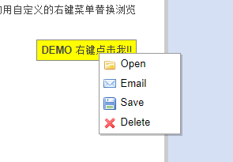

[TOC]


# timeline软件设定

## jdk

1.7

## 容器

Tomcat

## 存储

timelines.serialzation 统一存放所有的时间线信息(用序列化存储,避免解析带来的麻烦). 类似一个索引文件,存放所有的时间线信息.
不同的时间线信息放在根目录的其他文件中.一个时间线一个文件.

\'${user.dir}\'/.timeline/timelines.serialzation


## 代码结构

```java
com.saguadan.servlet
	//放servlet
com.saguadan.service
	//放业务控制器
com.saguadan.jdbc
	//放DB操作。 目前没有DB操作.
```


### 软件加载流程

#### 	系统启动数据加载

​		加载存储中所有的json到内存(考虑还是按需要加载)。

#### 	 系统程序设计

##### http header

| header name       | memo                                                         |
| ----------------- | ------------------------------------------------------------ |
| service_controller | 用于指定提供服务的控制器,如果不存在对应的控制器,则使用默认控制器. |
| data_type         | 指明数据格式.默认是json.   约定有如下数据格式: json/xml/form/string/bytes |
| fmt                | 指明将上行的数据格式转换为什么类型. 默认是转化为map.  map/json/string |
| opt   | 在需要的时候可以带上opt,来分流执行. crudl c增加-->save()  r查看 get()  u修改 save() d删除 delete() l 列表. list() |
| ret_format    |   用于约定返回的时候，是否通过对结果做统一处理 ，改变原先的返回数据结构，增加上返回码和返回消息等。 如果不传，认为是需要的。|

​		利用上下文在启动注册器，注册所有的业务类。 业务类需要暴漏自己到注册器（com.saguadan.service.RegisterStatic）， 上下文启动注册器。

#### 	交互与转发

​	MainServlet 从http head中提取头参数 serviceController 来定位 提供服务器的**业务控制器**. **业务控制器**,类似于struct2的控制器,用来处理一些简单的业务和整合服务资源.

#### 开发命名规范

##### HTML部分文件名

业务名-list.html、业务名-input.html、业务名-view.html 。

###### 按钮ID规范

```
#列表页搜索按钮
id="search-list-业务名"
#编辑、添加页.
##确认、保存
id="save-input-业务名"
##取消
id="cancel-input-业务名"
#详情页
id="back-view-业务名"
```


##### js文件名

业务名-list.js、业务名-input.js、业务名-view.js


#### Q&A

+ 事例中的event和 API文档中的字段不一致，何解？

```json
###API中的字段访问如下。
https://timeline.knightlab.com/docs/json-format.html#json-slide

官方文档中没有type、location等2个字段。

{
            "start_date": {
                "year":			"1900",
                "month":		"01",
                "day": 			"05",
                "hour": 		"",
                "minute": 		"",
                "second": 		"",
                "millisecond": 	"",
                "format": 		""
            },
            "end_date": {
                "year":			"1900",
                "month":		"06",
                "day": 			"07",
                "hour": 		"",
                "minute": 		"",
                "second": 		"",
                "millisecond": 	"",
                "format": 		""
            },
            "location": {
                "icon": "http://maps.gstatic.com/intl/en_us/mapfiles/ms/micons/blue-pushpin.png",
                "lat": 39.491711,
                "line": true,
                "lon": -91.79326,
                "name": "Florida, Missouri",
                "zoom": 12
            },
            "background": {
                "color": "#999999",
                "opacity": 50,
                "url": null
            },
            "media": {
                "caption": "Twain caricatured by Spy for Vanity Fair, 1908",
                "credit": "Vanity Fair",
                "url": "http://knightlab.northwestern.edu/wp-content/uploads/2013/03/Northwestern_University_KnightLab_Logo1.png",
                "thumb": 	"http://knightlab.northwestern.edu/wp-content/uploads/2013/03/Northwestern_University_KnightLab_Logo1.png"
            },
            "text": {
                "headline": "Mark Twain JSON",
                "text": "Samuel Langhorne Clemens (November 30, 1835 \u2013 April 21, 1910), better known by his pen name Mark Twain, was an American author and humorist. He wrote The Adventures of Tom Sawyer (1876) and its sequel, Adventures of Huckleberry Finn (1885), the later often called \"the Great American Novel.\""
            },
            "type": "overview"
        }


```


#### 技术参考

##### timeline

```
#构造timelinejs3的几种方法。
https://timeline.knightlab.com/docs/instantiate-a-timeline.html

#
```

###### 采用的富文本编辑器参考地址 .

http://kindeditor.net/doc3.php


###### 右击事件参考

<http://www.jq22.com/yanshi2747>  


###### 编辑选择事件参考

<http://www.jq22.com/yanshi15758>


拖拽

<http://www.jq22.com/webqd6043>

<http://www.jq22.com/webqd5574>


粒子效果

<http://www.jq22.com/webqd5566>


