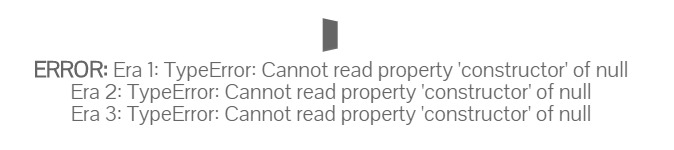

[TOC]


# timeline软件设定

## jdk

1.7

## 容器

Tomcat

#### 系统资源

##### 接听端口

51122 监听服务端口

51123 监听关闭端口

##### 内存配置

```shell
-Xms128m -Xmx512m -XX:PermSize=64m -XX:MaxPermSize=256m
```


## 存储

timelines.serialzation 统一存放所有的时间线信息(用序列化存储,避免解析带来的麻烦). 类似一个索引文件,存放所有的时间线信息.
不同的时间线信息放在根目录的其他文件中.一个时间线一个文件.

\'${catlina_home}\'/.timeline/timelines.serialzation


## 代码结构

```java
com.saguadan.servlet
	//放servlet
com.saguadan.service
	//放业务控制器
com.saguadan.jdbc
	//放DB操作。 目前没有DB操作.
```


### 软件加载流程

#### 	系统启动数据加载

​		加载存储中所有的json到内存(考虑还是按需要加载)。

### 	 系统程序设计

#### http header

| header name       | memo                                                         |
| ----------------- | ------------------------------------------------------------ |
| service_controller | 用于指定提供服务的控制器,如果不存在对应的控制器,则使用默认控制器. |
| data_type         | 指明数据格式.默认是json.   约定有如下数据格式: json/xml/form/string/bytes |
| fmt                | 指明将上行的数据格式转换为什么类型. 默认是转化为map.  map/json/string |
| opt   | 在需要的时候可以带上opt,来分流执行. crudl c增加-->save()  r查看 get()  u修改 save() d删除 delete() l 列表. list() |
| ret_format    |   用于约定返回的时候，是否通过对结果做统一处理 ，改变原先的返回数据结构，增加上返回码和返回消息等。 如果不传，认为是需要的。|

​		利用上下文在启动注册器，注册所有的业务类。 业务类需要暴漏自己到注册器（com.saguadan.service.RegisterStatic）， 上下文启动注册器。

​	note：如果存在引用关系，需要先注册被引用的对象。

#### 接口描述

##### 统一 接口地址约定

```url
http[s]://ip:port/[projectName/]r/*

##[] 为可选的意思。根据实际情况设定。
```

##### 统一下行数据格式约定为json

```json
{
code:""
message:""
data:""
}
/**
code 为业务码（返回码）。 具体查看 ##返回码
message 为提示信息。
data 为一个json格式的数据。为业务处理程序返回的内容。

note:因为程序的追求比较简单，给自己弄一个timeline的小程序用用。没有做验签等复杂的设计。
**/
```


##### 接口：保存事件数据、保存整个时间轴数据

```
##上行
###http header
service_controller:"timelineService"
opt:"u"
fmt:"string"
data_type:"json"
ret_format:"y"
###post data
filename: 对应持久化的文件名。
event: js object. 从页面元素中读取的所有字段组成的一个js对象。提交前会被转化为json。
_class:  event/eras/timeline. 当提交event的时候为event，当提交整个timeline的时候，为timeline


##下行（约定下行只对data做描述，除非有必要才对code做描述）
data:
{
_class  : 用于回显
event	: 用于回显，当_class = "event"时才有.
timeline : 用于回显， 当_class = "timeline"或者 "eras" 时才有.
}

js/jquery-1.7.1.js
js/jquery.hotkeys.js
js/jquery.blockUI.js
js/globalparams.js
js/getUrlParam.js
js/ajax_abstract.js
js/timelinejs3/timeline.js

```

#### 相关字段生成策略

##### unique_id

​	时间+随机长度为6字符串。 格式 yyyy-mm-dd-char(6)

#### 	交互与转发

​	MainServlet 从http head中提取头参数 serviceController 来定位 提供服务器的**业务控制器**. **业务控制器**,类似于struct2的控制器,用来处理一些简单的业务和整合服务资源.

##### 取色设定

 打开编辑页面的时候,自动取值到对应的色值.	直接同步联动即可,不需要再重新点击按钮取色了.


#### 开发命名规范

##### HTML部分文件名

业务名-list.html、业务名-input.html、业务名-view.html 。

###### 按钮ID规范

```
#列表页搜索按钮
id="search-list-业务名"
#编辑、添加页.
##确认、保存
id="save-input-业务名"
##取消
id="cancel-input-业务名"
#详情页
id="back-view-业务名"
```


##### js文件名

业务名-list.js、业务名-input.js、业务名-view.js


#### Q&A

+ 编辑当前slide的data后，如何生效？就是如何改变原来的值？

  ```js
  ...
  /**
  处理的办法目前将原先的数据读取出来，复制给一个新的对象。然后通过unique_id将原先的slide删除。然后加入一个新的slide。
  
  note： 这有个问题，获取过来的数据存在null的情况，而timeline没有对null做兼容。我的需求是读取数据并展现到页面，这个问题并不会发生。而且我从页面读取数据的时候，会获取到""，所以问题不大。
  **/
  		var _data = {};
          Object.assign(_data, timeline.getCurrentSlide().data);
          timeline.removeId(timeline.getCurrentSlide().data.unique_id);
          _data.text.headline = '我要改你的值，你同意吗？';
          
          timeline.add(_data);
          timeline.updateDisplay();
  		timeline.goToId(_data.unique_id);
  ...
  ```

  

+ 事例中的event和 API文档中的字段不一致，何解？

```json
###API中的字段访问如下。
https://timeline.knightlab.com/docs/json-format.html#json-slide

官方文档中没有type、location等2个字段。

{
            "start_date": {
                "year":			"1900",
                "month":		"01",
                "day": 			"05",
                "hour": 		"",
                "minute": 		"",
                "second": 		"",
                "millisecond": 	"",
                "format": 		""
            },
            "end_date": {
                "year":			"1900",
                "month":		"06",
                "day": 			"07",
                "hour": 		"",
                "minute": 		"",
                "second": 		"",
                "millisecond": 	"",
                "format": 		""
            },
            "location": {
                "icon": "http://maps.gstatic.com/intl/en_us/mapfiles/ms/micons/blue-pushpin.png",
                "lat": 39.491711,
                "line": true,
                "lon": -91.79326,
                "name": "Florida, Missouri",
                "zoom": 12
            },
            "background": {
                "color": "#999999",
                "opacity": 50,
                "url": null
            },
            "media": {
                "caption": "Twain caricatured by Spy for Vanity Fair, 1908",
                "credit": "Vanity Fair",
                "url": "http://knightlab.northwestern.edu/wp-content/uploads/2013/03/Northwestern_University_KnightLab_Logo1.png",
                "thumb": 	"http://knightlab.northwestern.edu/wp-content/uploads/2013/03/Northwestern_University_KnightLab_Logo1.png"
            },
            "text": {
                "headline": "Mark Twain JSON",
                "text": "Samuel Langhorne Clemens (November 30, 1835 \u2013 April 21, 1910), better known by his pen name Mark Twain, was an American author and humorist. He wrote The Adventures of Tom Sawyer (1876) and its sequel, Adventures of Huckleberry Finn (1885), the later often called \"the Great American Novel.\""
            },
            "type": "overview"
        }

```


### 返回码

| 返回码 | 原因描述                                                     |
| ------ | ------------------------------------------------------------ |
| 1      | 操作成功                                                     |
| -1     | 处理失败。                                                   |
| -2     | 业务处理返回null时候，系统检测到null值后，统一设置返回码为-2 |
|        |                                                              |

### 快捷键

| 快捷键                      | 作用                                         | 作用范围     |
| --------------------------- | -------------------------------------------- | ------------ |
| alt+e                       | 触发编辑当前选中的event                      | 时间轴详情页 |
| alt+c                       | 触发创建新的event                            | 时间轴详情页 |
| alt+i                       | 触发创建/编辑 Eras                           | 时间轴详情页 |
| alt+up \|\| alt+鼠标滚动+   | timline navigate zoom in(放大明细)           | 时间轴详情页 |
| alt+down\|\| alt+鼠标滚动-  | timline navigate zoom out(缩小明细/忽略明细) | 时间轴详情页 |
| alt+x  \|\| shift+鼠标滚动+ | timline navigate 高度变大                    | 时间轴详情页 |
| alt+s \|\| shift+鼠标滚动-  | timline navigate 高度变小                    | 时间轴详情页 |
|                             |                                              |              |


## 技术参考

##### jquery.hotkeys

```
https://github.com/tzuryby/jquery.hotkeys
```

​	It's cool!!

##### timeline

###### 构造timelinejs3的几种方法。

https://timeline.knightlab.com/docs/instantiate-a-timeline.html
目前我在使用的时利用自己组装的Json js对象来构造时间轴。

###### 获取timeline实例中eras的js

console.log(timeline.config.eras);
timeline.config.eras 这个是个数组.

###### 重新布局

这个目前没有找到合适的办法,只能先重新构造!!

```js
      var timeline_01 = new TL.Timeline('timeline1', 'marktwain_juked.json', {
      	timenav_height_percentage:50,
      	is_embed:true
      });
      var timeline_02 = new TL.Timeline('timeline2', 'marktwain_juked.json', {
      	timenav_height_percentage:75,
      	is_embed:true
      });
      var timeline_03 = new TL.Timeline('timeline3', 'marktwain_juked.json', {
      	timenav_height_percentage:25,
      	is_embed:true
      });

```


##### 采用的富文本编辑器参考地址 .

http://kindeditor.net/doc3.php


##### 右击事件参考

<http://www.jq22.com/yanshi2747>  


##### 编辑选择事件参考

<http://www.jq22.com/yanshi15758>


拖拽

<http://www.jq22.com/webqd6043>

<http://www.jq22.com/webqd5574>


粒子效果

<http://www.jq22.com/webqd5566>


其他js参考。

<https://yanhaijing.com/javascript/2015/05/09/diff-between-keys-getOwnPropertyNames-forin/>


## 流水记录

2019年6月24日16:31:29

	+ 点击下一个可以获取到change事件，读取到unique_id的值。
	+ 测试发现，可以通过timeline.getCurrentSlide().data 来获取当前选中滑块的数据。这样我就可以通过绑定快捷键的方式，来编辑当前滑块了。 

2019年6月25日10:46:30

- 把提交保存event事件的内容和提交整个timeline的内容放在同一个方法中处理。opt 都用u.


## TODO

- [x] 提交event data到服务端
- [x] unique_id 使用前端机制生成，不要用户自己输入。
- [x] media alt、title、link、link_target； start_date/end_date; display_date; 等没有回显 在编辑的时候。
- [x] 保存的hour字段丢失。
- [x] 视频不显示问题。重新刷新地址的时候可以加载，编辑添加后无法显示视频。
- [x] 编辑event后，保存未成功清理原先的event。note：服务端需要重写hashcode方法。
- [x] Ears是个数组
- [x] 
  目前没找到对应的可以直接增加Eras的API，所以目前只能通过重新装载整个timeline的方式来新增Eras。如果要加的话。2019年6月27日23:57:32   note:添加1个正常，多个的时候报如下错误，估计是js循环遍历逻辑有点小问题。 后台收到的json串是这样的：{"filename":"g02k72e8t0","eras":[{"start_date":{"year":"1981"},"end_date":{"year":"1990"}},{},{},{}],"_class":"eras"}
  ，
  + [x] 后台增加一个Set集合的非空校验。
  + [x] 同时在前端优化下循环代码。(猜测错误，是因为name属性没有导致的。)
- [x] 上传文件（视频、图片）
  - [x] 打开时也要加载图片和视频.
- [x] 添加timeline中的event有字段丢失，目前是year和headline，查下原因明天。
  这个原因是新增的eras代码中存在和原先name同名的问题，导致js不知道具体用哪个值
- [ ] 将编辑事件界面优化下，便于操作。
- [x] 增加主界面的几个快捷键，方便操作。
- [x] Eras没有回显.
- [x] 表单的非空校验。
  event，start_date.year、text.headline.
- [x] 原先的有个input变为textarea,这会导致取值方式发生了改变.
- [x] 取色器的取值和定位有问题,需要调整. ps: 原先的算法有问题,在计算offsetTop的时候没有减去scrollTop.
- [x] 去除其他不用的多余文件
- [x] 去除界面上的一些不合理的图片和文字
- [x] 当没有任何年份的时候,没有任何地方可以插入行,我说的是eras
- [ ] 弄个快捷键来设置底部的滚动条.
- [ ] 弄个快捷键来快速的填入当前时间.


## NOTE

+ 页面引入js的时候，需要把timeline.js插件放到jquery前面，否则会导致一些timeline的支持错误，比如无法正常根据unique_id来删除event.